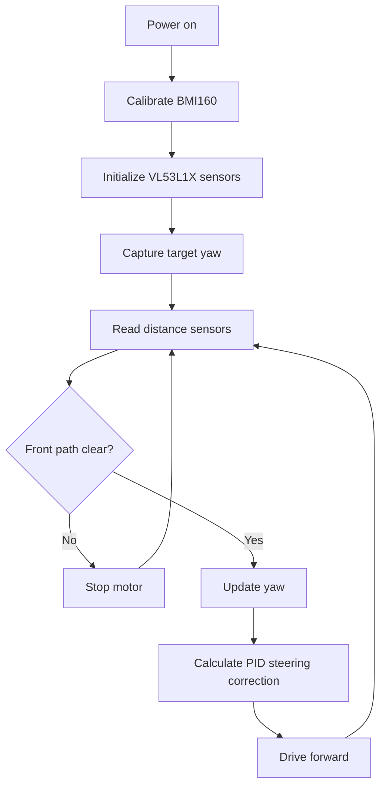

# TEAM NAME - ROBOT NAME

**Engineering documentation for WRO Future Engineers 2026**

[Demo Video](#demo-video) | [Rubric Map](#wro-2026-rubric-map) | [Build Guide](#robot-construction-guide) | [Source Code](./src/)

---

## Table Of Contents

- [Team](#team)
- [Challenge](#challenge)
- [Robot Overview](#robot-overview)
- [WRO 2026 Rubric Map](#wro-2026-rubric-map)
- [Mobility And Mechanical Design](#mobility-and-mechanical-design)
- [Power And Sensor Architecture](#power-and-sensor-architecture)
- [Software Architecture And Obstacle Strategy](#software-architecture-and-obstacle-strategy)
- [Systems Thinking And Engineering Decisions](#systems-thinking-and-engineering-decisions)
- [Robot Construction Guide](#robot-construction-guide)
- [Testing Workflow](#testing-workflow)
- [Demo Video](#demo-video)
- [Cost Report](#cost-report)
- [Repository Structure](#repository-structure)
- [Submission Checklist](#submission-checklist)

---

## Team

Replace the placeholders with your real team information and photos.

<table>
  <tr>
    <td align="center" width="33%">
       
      <strong>Member Name</strong> 
      Role: TODO 
      Focus: TODO
    </td>
    <td align="center" width="33%">
       
      <strong>Member Name</strong> 
      Role: TODO 
      Focus: TODO
    </td>
    <td align="center" width="33%">
       
      <strong>Coach / Mentor</strong> 
      Role: TODO 
      Focus: TODO
    </td>
  </tr>
</table>

Required team photos go in [`t-photos/`](./t-photos/).

---

## Challenge

WRO Future Engineers 2026 is a self-driving car challenge. The robot must drive autonomously on a field, handle randomized round conditions, complete Open Challenge and Obstacle Challenge runs, and document the full engineering process clearly enough for judges and other teams to understand the design.

The 2026 documentation score is based on five criteria worth up to 30 points total:

- Mobility and mechanical design.
- Power and sensor architecture.
- Software architecture and obstacle strategy.
- Systems thinking and engineering decisions.
- Reproducibility and GitHub quality.

Official rules: [WRO 2026 Future Engineers General Rules](https://wro-association.org/wp-content/uploads/WRO-2026-Future-Engineers-Self-Driving-Cars-General-Rules.pdf)

---

## Robot Overview

| Item | Current Plan / Evidence |
| --- | --- |
| Robot name | TODO |
| Main controller | TODO, current code is Arduino-compatible |
| Drive system | TODO |
| Steering system | Servo steering in current code |
| Sensors | BMI160 gyroscope, 3x VL53L1X distance sensors in current code |
| Main software | [`src/robot_controller_improved/robot_controller_improved.ino`](./src/robot_controller_improved/robot_controller_improved.ino) |
| Current behavior | Heading hold with PID and front obstacle safety stop |
| Next behavior to implement | Open Challenge navigation, Obstacle Challenge logic, parking logic if used |

### Vehicle Photos

Replace the placeholders with real vehicle photos in [`v-photos/`](./v-photos/).

<table>
  <tr>
    <td align="center"> <strong>Front</strong></td>
    <td align="center"> <strong>Back</strong></td>
    <td align="center"> <strong>Left</strong></td>
  </tr>
  <tr>
    <td align="center"> <strong>Right</strong></td>
    <td align="center"> <strong>Top</strong></td>
    <td align="center"> <strong>Bottom</strong></td>
  </tr>
</table>

---

## WRO 2026 Rubric Map

Use this table as the judge-facing index for the 2026 documentation rubric.

| 2026 Criterion | What Judges Need To See | Evidence Location | Status |
| --- | --- | --- | --- |
| Mobility and mechanical design | Chassis, drive, steering, torque/speed reasoning, stability, tests, iterations | [`models/`](./models/), [`v-photos/`](./v-photos/), [Mobility section](#mobility-and-mechanical-design) | TODO |
| Power and sensor architecture | Wiring, power distribution, sensor placement, selection reasoning, calibration, failure handling | [`schemes/`](./schemes/), [`other/calibration.md`](./other/calibration.md), [Power section](#power-and-sensor-architecture) | TODO |
| Software architecture and obstacle strategy | Flowchart/state machine, modules, lane logic, obstacle logic, edge cases, testing metrics | [`src/`](./src/), [`docs/software-architecture.md`](./docs/software-architecture.md), [Software section](#software-architecture-and-obstacle-strategy) | In progress |
| Systems thinking and engineering decisions | Constraints, tradeoffs, subsystem interactions, risks, mitigations, versions | [`docs/decisions.md`](./docs/decisions.md), [Decisions section](#systems-thinking-and-engineering-decisions) | TODO |
| Reproducibility and GitHub quality | Clear README, code, CAD, wiring, build steps, tests, meaningful commits, versioning | [`docs/build-instructions.md`](./docs/build-instructions.md), [`docs/tests.md`](./docs/tests.md), [Repository structure](#repository-structure) | In progress |

---

## Mobility And Mechanical Design

### Mechanical Summary

| Subsystem | Design | Reasoning | Evidence |
| --- | --- | --- | --- |
| Chassis | TODO | TODO | Add CAD/photos |
| Drive motor | TODO | TODO | Add specs/test data |
| Steering | TODO | TODO | Add linkage photos/dimensions |
| Wheels/tires | TODO | TODO | Add grip and turning tests |
| Mounting | TODO | TODO | Add model files |

### Powertrain

Document the drivetrain, gear ratio if used, motor torque, wheel diameter, and expected speed.

| Test | Result | What Changed |
| --- | --- | --- |
| Straight-line run | TODO | TODO |
| Corner entry | TODO | TODO |
| Three-minute endurance | TODO | TODO |

### Steering

Explain the steering mechanism, servo choice, steering limits, and how the steering center is calibrated.

### Chassis

Add the chassis design files to [`models/`](./models/) and explain:

- Why the chassis shape was chosen.
- How components are mounted.
- How weight is distributed.
- What changed between versions.

---

## Power And Sensor Architecture

### Power Distribution

Add the wiring and power diagrams to [`schemes/`](./schemes/).

| Component | Voltage | Peak Current | Power Source | Notes |
| --- | ---: | ---: | --- | --- |
| Controller | TODO | TODO | TODO | TODO |
| Drive motor | TODO | TODO | TODO | TODO |
| Steering servo | TODO | TODO | TODO | TODO |
| BMI160 | TODO | TODO | TODO | Used by current code |
| VL53L1X sensors | TODO | TODO | TODO | Three sensors used by current code |

### Sensor Placement

| Sensor | Position | Purpose | Calibration |
| --- | --- | --- | --- |
| BMI160 | TODO | Yaw estimation and heading hold | Keep robot still during startup |
| Front VL53L1X | Front | Safety stop and obstacle distance | Test at known distances |
| Left VL53L1X | Left | TODO | Test at known distances |
| Right VL53L1X | Right | TODO | Test at known distances |

### Failure Handling

| Failure Mode | Detection | Response |
| --- | --- | --- |
| Front sensor stale | Current code checks sensor freshness | Stop motor |
| Sensor timeout | Current code checks VL53L1X timeout | Mark reading invalid |
| Gyro drift | TODO | TODO |
| Low battery | TODO | TODO |

---

## Software Architecture And Obstacle Strategy

### Current Code

The current robot software is in [`src/robot_controller_improved/robot_controller_improved.ino`](./src/robot_controller_improved/robot_controller_improved.ino).

It currently:

- Initializes the BMI160 and three VL53L1X sensors.
- Assigns unique I2C addresses to the distance sensors.
- Captures the starting yaw angle.
- Uses a PID controller to hold heading while driving forward.
- Stops if the front sensor detects a close obstacle or stops updating.

### Current Flow

### Final State Machine Template

| State | Purpose | Entry Condition | Exit Condition | Notes |
| --- | --- | --- | --- | --- |
| Init | Calibrate and verify sensors | Power on | Sensors ready | TODO |
| OpenChallengeDrive | Complete laps without obstacles | Start button | Three laps or stop condition | TODO |
| ObstacleSearch | Detect traffic signs | Obstacle round | Sign detected | TODO |
| AvoidRed | Pass red sign correctly | Red sign detected | Safe path restored | TODO |
| AvoidGreen | Pass green sign correctly | Green sign detected | Safe path restored | TODO |
| Parking | Align with parking area | Laps complete | Parked/stopped | TODO |
| FailSafeStop | Stop safely | Sensor failure or unsafe condition | Manual reset | TODO |

### Algorithms To Explain

- Lane or wall following.
- Obstacle color detection and passing rule.
- Parking alignment.
- PID tuning.
- Sensor filtering.
- Recovery from bad readings.

---

## Systems Thinking And Engineering Decisions

Judges look for the reasoning behind the design, not only the final robot.

| Decision | Options Compared | Chosen Option | Why | Test Evidence |
| --- | --- | --- | --- | --- |
| Main controller | TODO | TODO | TODO | TODO |
| Distance sensor type | TODO | TODO | TODO | TODO |
| Steering geometry | TODO | TODO | TODO | TODO |
| Battery/regulator | TODO | TODO | TODO | TODO |

### Iteration Log

| Version | Change | Problem Solved | Evidence |
| --- | --- | --- | --- |
| v0.1 | Initial heading-hold code | Basic movement | Current source code |
| v0.2 | TODO | TODO | TODO |
| v1.0 | TODO | TODO | TODO |

### Risks

| Risk | Impact | Mitigation | Test |
| --- | --- | --- | --- |
| Sensor noise | Wrong steering or obstacle reaction | Filtering and stale-read checks | TODO |
| Gyro drift | Heading error over time | Calibration and drift test | TODO |
| Low battery | Slower motor or reset | Power budget and voltage checks | TODO |
| Mechanical flex | Poor steering repeatability | Stronger mounts and tests | TODO |

Detailed decision records belong in [`docs/decisions.md`](./docs/decisions.md).

---

## Robot Construction Guide

Complete [`docs/build-instructions.md`](./docs/build-instructions.md) so another team can reproduce the robot.

### Step 1: Print Or Fabricate Parts

- Add CAD/STL/STEP files to [`models/`](./models/).
- List print settings or fabrication settings.
- Add dimensions for critical parts.

### Step 2: Assemble The Chassis

- Mount the drive motor.
- Mount the steering servo and linkage.
- Mount the controller, sensors, battery, and wiring.

### Step 3: Wire Electronics

- Add wiring diagram to [`schemes/`](./schemes/).
- Confirm common ground.
- Confirm voltage regulators and current limits.

### Step 4: Upload Software

1. Open [`src/robot_controller_improved/robot_controller_improved.ino`](./src/robot_controller_improved/robot_controller_improved.ino) in Arduino IDE.
2. Install required libraries: `BMI160Gen`, `VL53L1X`, and `Servo`.
3. Select the correct board and port.
4. Upload the sketch.
5. Keep the robot still during startup calibration.

---

## Testing Workflow

Testing evidence belongs in [`docs/tests.md`](./docs/tests.md).

| Test | Metric | Target | Current Result |
| --- | --- | --- | --- |
| Gyro drift | Degrees drift over time | TODO | TODO |
| Distance accuracy | Error at known distances | TODO | TODO |
| Safety stop | Stop before obstacle | TODO | TODO |
| Straight-line PID | Heading error | TODO | TODO |
| Open Challenge | Laps and time | TODO | TODO |
| Obstacle Challenge | Sign handling and score | TODO | TODO |
| Parking | Final position and alignment | TODO | TODO |

---

## Demo Video

Add public video links in [`video/video.md`](./video/video.md).

| Video | Link | Robot Version | Date |
| --- | --- | --- | --- |
| Open Challenge run | TODO | TODO | TODO |
| Obstacle Challenge run | TODO | TODO | TODO |
| Build overview | TODO | TODO | TODO |

---

## Cost Report

Maintain the full bill of materials in [`other/bill-of-materials.md`](./other/bill-of-materials.md).

| Category | Estimated Cost | Notes |
| --- | ---: | --- |
| Mechanical parts | TODO | Chassis, printed parts, screws, mounts |
| Electronics | TODO | Controller, sensors, motor driver, regulators |
| Power | TODO | Batteries, holders, chargers |
| Tools/consumables | TODO | Filament, wires, connectors |
| Total | TODO | TODO |

---

## Repository Structure

| Folder | Purpose |
| --- | --- |
| [`src/`](./src/) | Robot control software |
| [`schemes/`](./schemes/) | Wiring, power, and sensor diagrams |
| [`models/`](./models/) | CAD, STL, STEP, laser cutting, or CNC files |
| [`v-photos/`](./v-photos/) | Vehicle photos from all required angles |
| [`t-photos/`](./t-photos/) | Team photos |
| [`video/`](./video/) | Demo video links |
| [`docs/`](./docs/) | Engineering journal, build guide, tests, decisions |
| [`other/`](./other/) | BOM, calibration notes, datasets, hardware specs, supporting assets |

---

## Submission Checklist

- [ ] Team details and team photos are complete.
- [ ] Vehicle photos show front, back, left, right, top, bottom, wiring, and sensors.
- [ ] README explains the robot clearly and links to all evidence.
- [ ] Engineering journal tells the design story and includes reasoning.
- [ ] Mechanical design includes CAD/model files and dimensions.
- [ ] Power and wiring diagrams are included.
- [ ] Sensor placement and calibration are documented.
- [ ] Software architecture includes flowchart/state machine and obstacle strategy.
- [ ] Tests include results, metrics, and changes made after testing.
- [ ] Decisions include alternatives, tradeoffs, and risks.
- [ ] Build instructions let another team reproduce the robot.
- [ ] Demo video links are public.
- [ ] Git history has at least three meaningful commits.

---

## License

TODO: Add the project license if the team wants to publish the code and designs under an open-source license.

