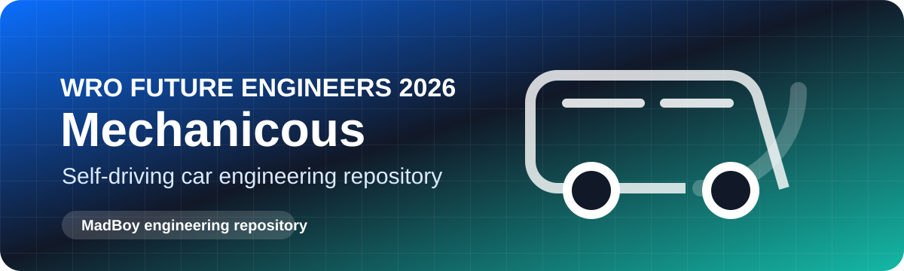
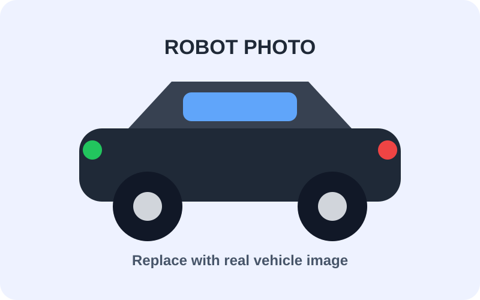
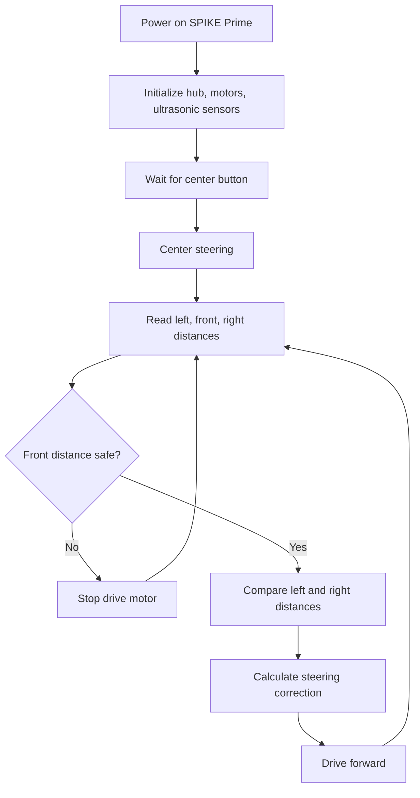

# TEAM NAME - ROBOT NAME

**WRO Future Engineers 2026 engineering documentation**

[Demo Video](#demo-video) | [Rubric Map](#wro-2026-rubric-map) | [Build Guide](#robot-construction-guide) | [Source Code](./src/)

---

## Table Of Contents

- [Team](#team)
- [Challenge](#challenge)
- [Robot Overview](#robot-overview)
- [WRO 2026 Rubric Map](#wro-2026-rubric-map)
- [Mobility And Mechanical Design](#mobility-and-mechanical-design)
- [Power And Sensor Architecture](#power-and-sensor-architecture)
- [Software Architecture And Obstacle Strategy](#software-architecture-and-obstacle-strategy)
- [Systems Thinking And Engineering Decisions](#systems-thinking-and-engineering-decisions)
- [Robot Construction Guide](#robot-construction-guide)
- [Testing Workflow](#testing-workflow)
- [Demo Video](#demo-video)
- [Cost Report](#cost-report)
- [Repository Structure](#repository-structure)
- [Submission Checklist](#submission-checklist)

---

## Team

Replace the placeholders with your real team information and photos.

<table>
  <tr>
    <td align="center" width="33%">
       
      <strong>Ibrahim Daraghma</strong> 
      Role: TODO 
      Focus: TODO
    </td>
    <td align="center" width="33%">
       
      <strong>Member Name</strong> 
      Role: TODO 
      Focus: TODO
    </td>
    <td align="center" width="33%">
       
      <strong>Coach / Mentor</strong> 
      Role: TODO 
      Focus: TODO
    </td>
  </tr>
</table>

Required team photos go in [`t-photos/`](./t-photos/).

---

## Challenge

WRO Future Engineers 2026 is a self-driving car challenge. The robot must drive autonomously on a field, handle randomized round conditions, complete Open Challenge and Obstacle Challenge runs, and document the full engineering process clearly enough for judges and other teams to understand the design.

The official 2026 documentation rubric is organized around five engineering areas:

- Mobility and mechanical design.
- Power and sensor architecture.
- Software architecture and obstacle strategy.
- Systems thinking and engineering decisions.
- Reproducibility and GitHub quality.

Official rules: [WRO 2026 Future Engineers General Rules](https://wro-association.org/wp-content/uploads/WRO-2026-Future-Engineers-Self-Driving-Cars-General-Rules.pdf)  
Official rubric: [WRO 2026 Future Engineers Documentation Rubric](https://wro-association.org/wp-content/uploads/WRO-2026-Future-Engineers-Documentation-Rubric.pdf)

---

## Robot Overview

| Item | Current Plan / Evidence |
| --- | --- |
| Robot name | TODO |
| Main controller | LEGO SPIKE Prime Hub |
| Programming platform | Pybricks MicroPython |
| Drive system | TODO: document motor count, port, gearing, and wheel size |
| Steering system | TODO: document steering motor/linkage or differential steering design |
| Sensors | 3x LEGO ultrasonic sensors: left, middle/front, right |
| Active source code | [`src/pybricks/main.py`](./src/pybricks/main.py) |
| Current behavior | Starter wall-balancing loop with front safety stop |
| Next behavior to implement | Open Challenge lap logic, Obstacle Challenge sign strategy, parking if used |

### Vehicle Photos

Replace the placeholders with real vehicle photos in [`v-photos/`](./v-photos/).

<table>
  <tr>
    <td align="center"> <strong>Front</strong></td>
    <td align="center"> <strong>Back</strong></td>
    <td align="center"> <strong>Left</strong></td>
  </tr>
  <tr>
    <td align="center"> <strong>Right</strong></td>
    <td align="center"> <strong>Top</strong></td>
    <td align="center"> <strong>Bottom</strong></td>
  </tr>
</table>

---

## WRO 2026 Rubric Map

Use this table as the judge-facing index for the 2026 documentation rubric.

| 2026 Criterion | What Judges Need To See | Evidence Location | Status |
| --- | --- | --- | --- |
| Mobility and mechanical design | LEGO chassis, steering/drive mechanism, gear reasoning, dimensions, stability, iterations | [`models/`](./models/), [`v-photos/`](./v-photos/), [Mobility section](#mobility-and-mechanical-design) | TODO |
| Power and sensor architecture | SPIKE Prime hub, port map, battery/power notes, ultrasonic placement, calibration, failure handling | [`schemes/`](./schemes/), [`schemes/port-map.md`](./schemes/port-map.md), [`other/calibration.md`](./other/calibration.md), [Power section](#power-and-sensor-architecture) | In progress |
| Software architecture and obstacle strategy | Pybricks code, flowchart/state machine, wall-following, obstacle strategy, edge cases, tests | [`src/`](./src/), [`docs/software-architecture.md`](./docs/software-architecture.md), [Software section](#software-architecture-and-obstacle-strategy) | In progress |
| Systems thinking and engineering decisions | Why LEGO SPIKE Prime was chosen, tradeoffs, risks, version history, testing response | [`docs/decisions.md`](./docs/decisions.md), [Decisions section](#systems-thinking-and-engineering-decisions) | In progress |
| Reproducibility and GitHub quality | README, source code, build steps, photos, diagrams, tests, meaningful commits | [`docs/build-instructions.md`](./docs/build-instructions.md), [`docs/tests.md`](./docs/tests.md), [Repository structure](#repository-structure) | In progress |

---

## Mobility And Mechanical Design

### Mechanical Summary

| Subsystem | Design | Reasoning | Evidence |
| --- | --- | --- | --- |
| Chassis | LEGO SPIKE Prime / Technic construction | Fast rebuilds, repeatable geometry, simpler maintenance | Add photos and dimensions |
| Drive motor | TODO: document motor type, port, gearing, wheel diameter | Needed for speed/torque reasoning | Add gear ratio and tests |
| Steering | TODO: document steering motor/linkage or differential steering | Needed for turn radius and stability | Add linkage photos/dimensions |
| Sensors | Left, middle/front, and right ultrasonic sensors | Wall distance and front safety/obstacle distance | Add sensor placement diagram |
| Mounting | LEGO beams, frames, and pins | Easy iteration and legal reproducibility | Add build photos/model files |

### Powertrain

Document the drivetrain, gear ratio if used, motor torque/speed tradeoff, wheel diameter, and expected field speed.

| Test | Result | What Changed |
| --- | --- | --- |
| Straight-line run | TODO | TODO |
| Corner entry | TODO | TODO |
| Three-minute endurance | TODO | TODO |

### Steering

Explain the steering mechanism, motor choice, steering limits, center calibration, and how the Pybricks steering sign is verified. If the robot uses differential steering instead of a steering linkage, replace this section with left/right drive motor reasoning.

### Chassis

Add build photos and any digital LEGO model files to [`models/`](./models/). Explain:

- Why the LEGO frame shape was chosen.
- How the hub, motors, and ultrasonic sensors are mounted.
- How weight is distributed.
- What changed between versions.

---

## Power And Sensor Architecture

### SPIKE Prime Port Map

Keep the active port map in [`schemes/port-map.md`](./schemes/port-map.md).

| Device | Current Port | Purpose | Notes |
| --- | --- | --- | --- |
| Drive motor | A | Move the robot forward/reverse | TODO: confirm |
| Steering motor | B | Turn steering linkage | TODO: confirm, or replace with second drive motor |
| Left ultrasonic sensor | C | Measure left wall distance | TODO: confirm |
| Middle/front ultrasonic sensor | D | Measure front path and obstacle distance | TODO: confirm |
| Right ultrasonic sensor | E | Measure right wall distance | TODO: confirm |
| Spare / future camera or sensor | F | TODO | TODO |

### Power Distribution

The LEGO SPIKE Prime rechargeable battery powers the hub and connected Powered Up motors/sensors through the hub ports. Add a diagram or photo showing the hub, motor ports, sensor ports, and cable routing in [`schemes/`](./schemes/).

### Sensor Placement

| Sensor | Position | Purpose | Calibration |
| --- | --- | --- | --- |
| Left ultrasonic | Left side | Wall distance and lane centering | Test readings at known distances |
| Middle/front ultrasonic | Middle/front | Front safety stop and obstacle approach distance | Test close-range stop threshold |
| Right ultrasonic | Right side | Wall distance and lane centering | Test readings at known distances |

### Failure Handling

| Failure Mode | Detection | Response |
| --- | --- | --- |
| Front sensor reports too close | Front distance below threshold | Stop drive motor |
| Front sensor unavailable | Reading rejected by software | Stop until reading returns |
| Left/right sensor noisy or out of range | Clamp steering correction | Keep steering limited |
| Low hub battery | TODO: document observed behavior | Charge before official run |

---

## Software Architecture And Obstacle Strategy

### Current Code

The active robot software is [`src/pybricks/main.py`](./src/pybricks/main.py).

It currently:

- Runs on a LEGO SPIKE Prime Hub using Pybricks MicroPython.
- Reads three ultrasonic sensors: left, middle/front, and right.
- Uses the middle/front ultrasonic sensor as a safety stop.
- Uses left/right distance difference for a starter wall-balancing steering correction.
- Keeps all port assignments and control constants near the top of the file for easy tuning.

### Current Flow

### Final State Machine Template

| State | Purpose | Entry Condition | Exit Condition | Notes |
| --- | --- | --- | --- | --- |
| Init | Verify ports, sensors, motors, and battery | Program start | Hardware ready | TODO |
| WaitForStart | Keep robot still before official run | Hub center button or start condition | Start pressed | TODO |
| OpenChallengeDrive | Complete laps without colored obstacles | Open Challenge run starts | Laps complete or timeout | TODO |
| WallCentering | Maintain position using side ultrasonic sensors | Driving straight/curving | Corner or obstacle detected | Starter code exists |
| ObstacleDetect | Detect obstacle approach with front sensor and future vision/color method | Obstacle Challenge | Obstacle classified | TODO |
| AvoidRed | Pass red obstacle according to WRO rules | Red obstacle detected | Safe path restored | TODO |
| AvoidGreen | Pass green obstacle according to WRO rules | Green obstacle detected | Safe path restored | TODO |
| Parking | Align with parking zone if used | Final lap/parking trigger | Parked/stopped | TODO |
| FailSafeStop | Stop safely | Unsafe or invalid readings | Manual reset or safe reading | Starter code exists |

### Algorithms To Explain

- Wall centering from left/right ultrasonic sensors.
- Front obstacle distance threshold.
- Corner detection.
- Lap counting.
- Obstacle color detection strategy if added later.
- Recovery from bad ultrasonic readings.
- Steering calibration and sign testing.

---

## Systems Thinking And Engineering Decisions

Judges look for the reasoning behind the design, not only the final robot.

| Decision | Options Compared | Chosen Option | Why | Test Evidence |
| --- | --- | --- | --- | --- |
| Controller platform | Arduino custom electronics vs LEGO SPIKE Prime | LEGO SPIKE Prime | Faster iteration, integrated battery, robust ports, Pybricks support | TODO |
| Programming language | Arduino C++ vs Pybricks MicroPython | Pybricks MicroPython | Cleaner high-level motor/sensor APIs and easier tuning | TODO |
| Distance sensing | VL53L1X ToF vs LEGO ultrasonic | Three LEGO ultrasonic sensors | Matches new LEGO build and simple wall-distance measurements | TODO |
| Navigation strategy | Gyro heading hold vs ultrasonic wall centering | Ultrasonic wall centering starter | Uses current sensor set without an external IMU | TODO |

### Iteration Log

| Version | Change | Problem Solved | Evidence |
| --- | --- | --- | --- |
| v0.1 | Arduino prototype with BMI160 and VL53L1X sensors | First heading-hold experiment | Git history |
| v0.2 | Switched to LEGO SPIKE Prime, Pybricks, and 3 ultrasonic sensors | Simpler integrated robot platform | Current README and source |
| v0.3 | TODO | TODO | TODO |

### Risks

| Risk | Impact | Mitigation | Test |
| --- | --- | --- | --- |
| Ultrasonic reflections | Wrong distance near angled walls or obstacles | Use repeated tests, clamp steering, tune thresholds | TODO |
| No gyro in current plan | Heading estimate may be weaker | Use wall centering and corner detection | TODO |
| Steering sign reversed | Robot steers into wall | Test at low speed and flip `STEERING_SIGN` | TODO |
| LEGO structure flex | Sensor angle or steering changes during run | Reinforce mounts and inspect after runs | TODO |
| Hub battery low | Motor speed changes during run | Charge before tests and record battery state | TODO |

Detailed decision records belong in [`docs/decisions.md`](./docs/decisions.md).

---

## Robot Construction Guide

Complete [`docs/build-instructions.md`](./docs/build-instructions.md) so another team can reproduce the robot.

### Step 1: Build The LEGO Chassis

- Add LEGO model files or step photos to [`models/`](./models/).
- Record wheelbase, track width, hub position, and sensor heights.
- Show how the hub is secured and how cables are routed.

### Step 2: Mount Motors And Steering

- Mount the drive motor and document its port.
- Mount the steering motor or differential drive motors and document the ports.
- Check that wheels and steering move freely.

### Step 3: Mount Ultrasonic Sensors

- Left ultrasonic sensor faces the left wall.
- Middle/front ultrasonic sensor faces forward.
- Right ultrasonic sensor faces the right wall.
- Measure and record sensor height, angle, and offset from the robot centerline.

### Step 4: Upload Pybricks Code

1. Install Pybricks firmware on the SPIKE Prime Hub if it is not already installed.
2. Open [Pybricks Code](https://code.pybricks.com/) in a browser.
3. Connect the SPIKE Prime Hub.
4. Open [`src/pybricks/main.py`](./src/pybricks/main.py).
5. Confirm the port constants match the real robot.
6. Upload/run the program.
7. Start at low speed and verify steering direction before full-speed tests.

---

## Testing Workflow

Testing evidence belongs in [`docs/tests.md`](./docs/tests.md).

| Test | Metric | Target | Current Result |
| --- | --- | --- | --- |
| Ultrasonic accuracy | Error at known distances | TODO | TODO |
| Front safety stop | Stop distance from obstacle | TODO | TODO |
| Steering center | Straight run drift | TODO | TODO |
| Steering sign | Correct response to left/right offset | TODO | TODO |
| Wall centering | Average side-distance error | TODO | TODO |
| Open Challenge | Laps and time | TODO | TODO |
| Obstacle Challenge | Obstacle handling and score | TODO | TODO |
| Parking | Final position and alignment | TODO | TODO |

---

## Demo Video

Add public video links in [`video/video.md`](./video/video.md).

| Video | Link | Robot Version | Date |
| --- | --- | --- | --- |
| Open Challenge run | TODO | TODO | TODO |
| Obstacle Challenge run | TODO | TODO | TODO |
| Build overview | TODO | TODO | TODO |

---

## Cost Report

Maintain the full bill of materials in [`other/bill-of-materials.md`](./other/bill-of-materials.md).

| Category | Estimated Cost | Notes |
| --- | ---: | --- |
| LEGO SPIKE Prime set/parts | TODO | Hub, motors, beams, frames, wheels |
| Sensors | TODO | Three ultrasonic sensors |
| Power | TODO | SPIKE Prime rechargeable battery and charger |
| Extra LEGO parts | TODO | Gears, beams, pins, wheels, mounts |
| Total | TODO | TODO |

---

## Repository Structure

| Folder | Purpose |
| --- | --- |
| [`src/`](./src/) | Pybricks MicroPython robot code |
| [`schemes/`](./schemes/) | SPIKE Prime port map, sensor placement, and power/connection diagrams |
| [`models/`](./models/) | LEGO digital model files, build photos, or reproducible assembly notes |
| [`v-photos/`](./v-photos/) | Vehicle photos from all required angles |
| [`t-photos/`](./t-photos/) | Team photos |
| [`video/`](./video/) | Demo video links |
| [`docs/`](./docs/) | Engineering journal, build guide, tests, decisions |
| [`other/`](./other/) | BOM, calibration notes, datasets, hardware specs, supporting assets |

---

## Submission Checklist

- [ ] Team details and team photos are complete.
- [ ] Vehicle photos show front, back, left, right, top, bottom, wiring/ports, and sensors.
- [ ] README explains the LEGO SPIKE Prime robot clearly and links to all evidence.
- [ ] Engineering journal tells the design story and includes reasoning.
- [ ] Mechanical design includes LEGO model/build files, photos, and dimensions.
- [ ] SPIKE Prime port map and sensor placement diagrams are included.
- [ ] Ultrasonic sensor calibration is documented.
- [ ] Software architecture includes flowchart/state machine and obstacle strategy.
- [ ] Tests include results, metrics, and changes made after testing.
- [ ] Decisions include alternatives, tradeoffs, and risks.
- [ ] Build instructions let another team reproduce the robot.
- [ ] Demo video links are public.
- [ ] Git history has meaningful commits.

---

## License

TODO: Add the project license if the team wants to publish the code and designs under an open-source license.
