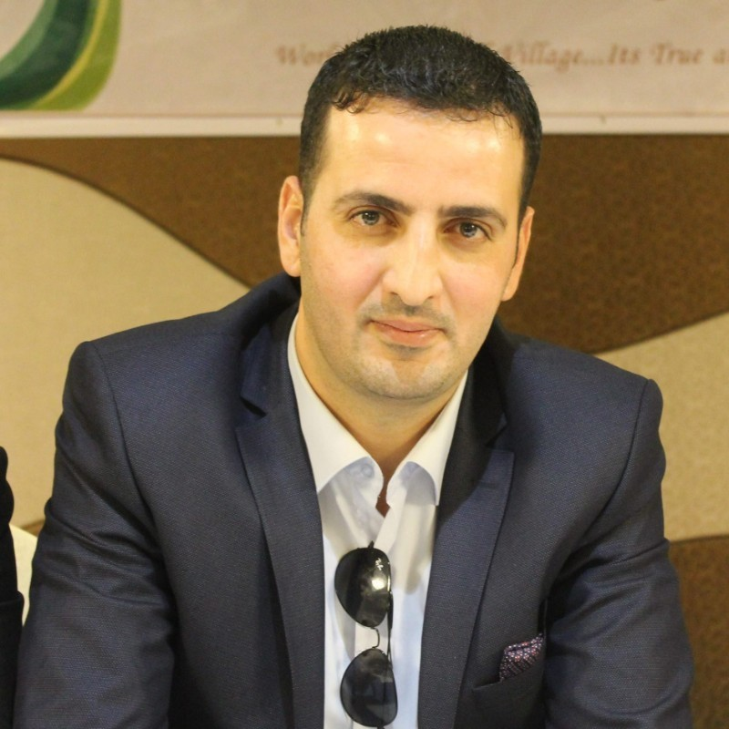
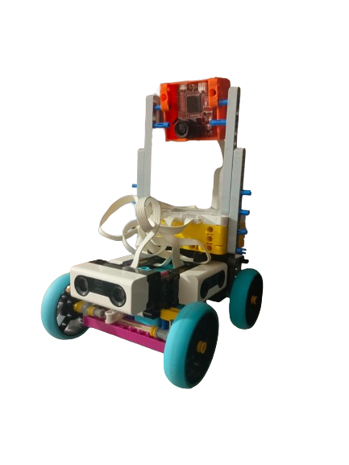
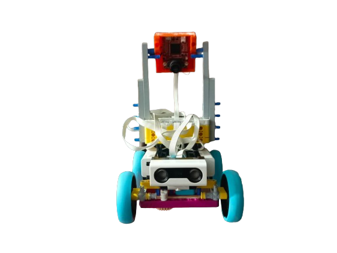
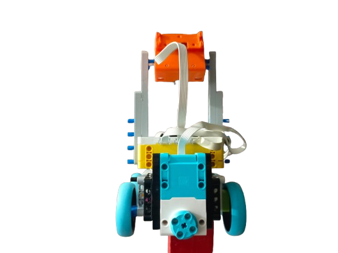
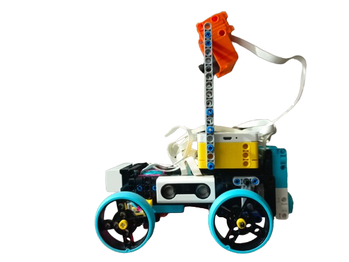
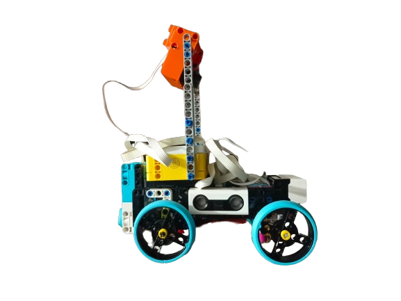
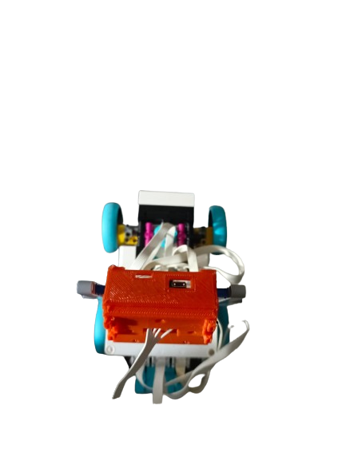
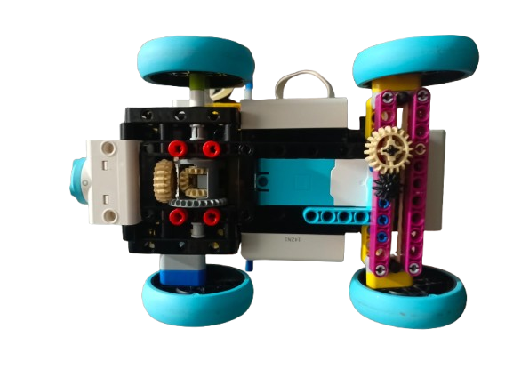
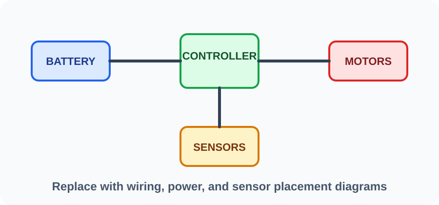
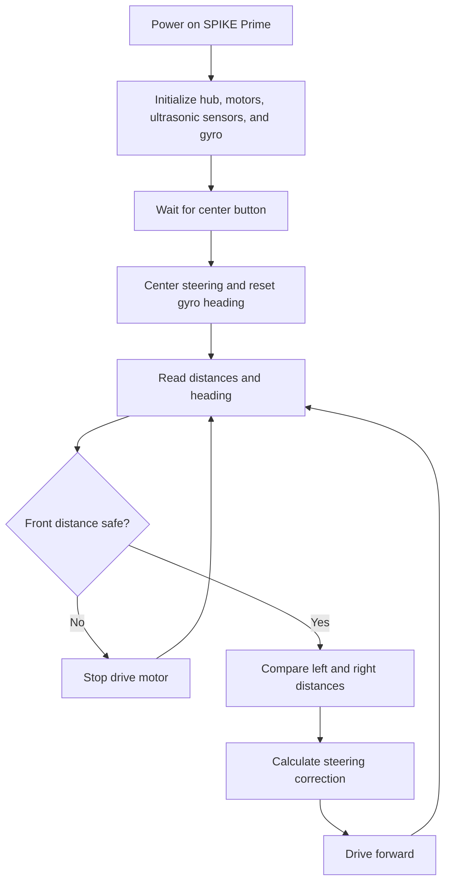

# Mechanicous - MadBoy

**WRO Future Engineers 2026 engineering documentation**

[Demo Video](#demo-video) | [Rubric Map](#wro-2026-rubric-map) | [Build Guide](#robot-construction-guide) | [Source Code](./src/)

---

## Table Of Contents

- [Team](#team)
- [Challenge](#challenge)
- [Robot Overview](#robot-overview)
- [WRO 2026 Rubric Map](#wro-2026-rubric-map)
- [Mobility And Mechanical Design](#mobility-and-mechanical-design)
- [Power And Sensor Architecture](#power-and-sensor-architecture)
- [Software Architecture And Obstacle Strategy](#software-architecture-and-obstacle-strategy)
- [Systems Thinking And Engineering Decisions](#systems-thinking-and-engineering-decisions)
- [Robot Construction Guide](#robot-construction-guide)
- [Testing Workflow](#testing-workflow)
- [Demo Video](#demo-video)
- [Cost Report](#cost-report)
- [Repository Structure](#repository-structure)
- [Submission Checklist](#submission-checklist)

---

## Team

<table>
  <tr>
    <td align="center" width="33%">
       
      <strong>Ibrahim Daraghma</strong> 
      Role: Member 
      Focus: Designing And Coding
    </td>
    <td align="center" width="33%">
       
      <strong>Ali Foqha</strong> 
      Role: Member 
      Focus: Coding And Thinking
    </td>
    <td align="center" width="33%">
       
      <strong>Qais Shrideh</strong> 
      Role: Coach 
      Focus: Team guidance
    </td>
  </tr>
</table>

Photos can be found in [`t-photos/`](./t-photos/).

---

## Challenge

WRO Future Engineers 2026 is a self-driving car challenge. The robot must drive autonomously on a field, handle randomized round conditions, complete Open Challenge and Obstacle Challenge runs, and document the full engineering process clearly enough for judges and other teams to understand the design.

The official 2026 documentation rubric is organized around five engineering areas:

- Mobility and mechanical design.
- Power and sensor architecture.
- Software architecture and obstacle strategy.
- Systems thinking and engineering decisions.
- Reproducibility and GitHub quality.

Official rules: [WRO 2026 Future Engineers General Rules](https://wro-association.org/wp-content/uploads/WRO-2026-Future-Engineers-Self-Driving-Cars-General-Rules.pdf)  
Official rubric: [WRO 2026 Future Engineers Documentation Rubric](https://wro-association.org/wp-content/uploads/WRO-2026-Future-Engineers-Documentation-Rubric.pdf)

---

## Robot Overview

| Item | Current Plan / Evidence |
| --- | --- |
| Robot name | MadBoy |
| Main controller | LEGO SPIKE Prime Hub |
| Programming platform | Pybricks MicroPython |
| Drive system | Rear-wheel drive using a SPIKE Large Angular Motor and rear differential gear system |
| Steering system | Front steering using a SPIKE Medium Angular Motor |
| Sensors | 3x LEGO ultrasonic sensors, SPIKE Prime integrated gyro/IMU, OpenMV H7 camera |
| Active source code | [`src/pybricks/main.py`](./src/pybricks/main.py) |
| Current behavior | Completes 3 laps in the Open Challenge round |
| Next behavior to implement | Obstacle Challenge sign strategy and course handling |

### Vehicle Photos

Vehicle photos can be found in [`v-photos/`](./v-photos/).

<table>
  <tr>
    <td align="center"> <strong>Front</strong></td>
    <td align="center"> <strong>Back</strong></td>
    <td align="center"> <strong>Left</strong></td>
  </tr>
  <tr>
    <td align="center"> <strong>Right</strong></td>
    <td align="center"> <strong>Top</strong></td>
    <td align="center"> <strong>Bottom</strong></td>
  </tr>
</table>

---

## WRO 2026 Rubric Map

Use this table as the judge-facing index for the 2026 documentation rubric.

| 2026 Criterion | What Judges Need To See | Evidence Location | Status |
| --- | --- | --- | --- |
| Mobility and mechanical design | LEGO chassis, steering/drive mechanism, gear reasoning, dimensions, stability, iterations | [`models/`](./models/), [`v-photos/`](./v-photos/), [Mobility section](#mobility-and-mechanical-design) | TODO |
| Power and sensor architecture | SPIKE Prime hub, port map, battery/power notes, ultrasonic placement, integrated gyro use, OpenMV H7 UART communication using PUPRemote/LPF2 libraries, calibration, failure handling | [`schemes/`](./schemes/), [`schemes/port-map.md`](./schemes/port-map.md), [`other/calibration.md`](./other/calibration.md), [Power section](#power-and-sensor-architecture) | In progress |
| Software architecture and obstacle strategy | Pybricks code, gyro heading telemetry, flowchart/state machine, wall-following, OpenMV obstacle strategy, edge cases, tests | [`src/`](./src/), [`docs/software-architecture.md`](./docs/software-architecture.md), [Software section](#software-architecture-and-obstacle-strategy) | In progress |
| Systems thinking and engineering decisions | Why LEGO SPIKE Prime was chosen, tradeoffs, risks, version history, testing response | [`docs/decisions.md`](./docs/decisions.md), [Decisions section](#systems-thinking-and-engineering-decisions) | In progress |
| Reproducibility and GitHub quality | README, source code, build steps, photos, diagrams, tests, meaningful commits | [`docs/build-instructions.md`](./docs/build-instructions.md), [`docs/tests.md`](./docs/tests.md), [Repository structure](#repository-structure) | In progress |

---

## Mobility And Mechanical Design

### Mechanical Summary

| Subsystem | Design | Reasoning | Evidence |
| --- | --- | --- | --- |
| Chassis | LEGO SPIKE Prime / Technic construction, about 20 cm long x 13.5 cm wide x 22 cm high | Fast rebuilds, repeatable geometry, simpler maintenance, and within the WRO FE 30 cm x 20 cm x 30 cm size limit | [`v-photos/`](./v-photos/), [`models/Robot_Design.io`](./models/Robot_Design.io) |
| Drive motor | SPIKE Large Angular Motor driving a 20-tooth double bevel gear into a 28-tooth differential gear | Rear-wheel traction with smoother turning between left/right rear wheels | Approx. 20:28 reduction, wheel diameter about 5.5 cm; add speed tests |
| Steering | SPIKE Medium Angular Motor drives a 12-tooth gear into a 20-tooth gear, moving an arm linkage that steers the front wheels | Dedicated steering actuator keeps drive and steering control separate; 12:20 reduction improves steering torque | Steering range is about 45 degrees left and 45 degrees right |
| Sensors | Left/middle/right ultrasonic sensors, integrated gyro, OpenMV H7 | Distance, heading feedback, and vision/color detection | Sensor and camera heights documented below |
| Mounting | LEGO beams, frames, and pins | Easy iteration and legal reproducibility | Add build photos/model files |

### Powertrain

The robot uses rear-wheel drive. A SPIKE Large Angular Motor drives a beige 20-tooth double bevel gear, which drives the 28-tooth gear on the LEGO differential. This creates an approximate 20:28 reduction, so the differential turns about 0.71 times for each motor gear rotation while increasing torque by about 1.4x before friction losses. The differential contains three 12-tooth bevel gears so the left and right rear wheels can rotate at different speeds while turning.

### Dimensions

| Measurement | Approximate Value | Notes |
| --- | ---: | --- |
| Length | 20 cm | Within WRO FE 30 cm maximum length |
| Width | 13.5 cm | Within WRO FE 20 cm maximum width |
| Height | 22 cm | Within WRO FE 30 cm maximum height |
| Wheelbase | 10.3 cm | Front axle center to rear axle center |
| Front track width | 11.2 cm | Left front wheel center to right front wheel center |
| Rear track width | 11.2 cm | About the same as front track width |
| Wheel diameter | 5.5 cm | LEGO wheel/tire diameter |

Current size check: MadBoy fits inside the WRO Future Engineers 2026 maximum robot size of 30 cm length x 20 cm width x 30 cm height.

| Test | Result | What Changed |
| --- | --- | --- |
| Straight-line run | Completes 3 Open Challenge laps | Current drivetrain retained |
| Corner entry | TODO | TODO |
| Three-minute endurance | TODO | TODO |

### Steering

The robot uses a SPIKE Medium Angular Motor for steering. The motor drives a 12-tooth gear, which drives a 20-tooth gear connected to an arm linkage. Moving this arm moves the steering system and turns the front wheels. The maximum steering range is about 45 degrees left and 45 degrees right, which matches the `STEERING_LEFT_LIMIT_DEG = -45` and `STEERING_RIGHT_LIMIT_DEG = 45` limits in [`src/pybricks/main.py`](./src/pybricks/main.py).

### Chassis

The robot design is available as a Studio 2.0 file at [`models/Robot_Design.io`](./models/Robot_Design.io). It includes the step-by-step building instructions for MadBoy.

Use the model and build photos in [`models/`](./models/) to explain:

- Why the LEGO frame shape was chosen.
- How the hub, motors, and ultrasonic sensors are mounted.
- How weight is distributed.
- What changed between versions.

---

## Power And Sensor Architecture

### SPIKE Prime Port Map

Keep the active port map in [`schemes/port-map.md`](./schemes/port-map.md).

| Device | Current Port | Purpose | Notes |
| --- | --- | --- | --- |
| Drive motor | A | SPIKE Large Angular Motor for rear-wheel drive | Confirmed |
| Steering motor | E | SPIKE Medium Angular Motor for front steering | Confirmed |
| Left ultrasonic sensor | B | Measure left wall distance | Confirmed |
| Middle/front ultrasonic sensor | D | Measure front path and obstacle distance | Confirmed |
| Right ultrasonic sensor | F | Measure right wall distance | Confirmed |
| Integrated gyro/IMU | SPIKE Prime Hub | Heading and turn feedback | Built into hub |
| OpenMV H7 camera | C | Vision and obstacle color detection | Confirmed UART protocol; PUPRemote/LPF2 libraries used in code |

### Power Distribution

The LEGO SPIKE Prime rechargeable battery powers the hub and connected Powered Up motors/sensors through the hub ports. Before each run, the team charges the hub battery to full, checks that every cable is connected, confirms that the LEGO structure is steady and sturdy, and verifies that all motors, sensors, and camera parts are in place.

### Sensor Placement

| Sensor | Position | Purpose | Calibration |
| --- | --- | --- | --- |
| Left ultrasonic | Left side, about 5 cm from the floor, facing outward to the left | Wall distance and lane centering | Test readings at known distances |
| Middle/front ultrasonic | Middle/front, about 6 cm from the floor, facing forward | Front safety stop and obstacle approach distance | Test close-range stop threshold |
| Right ultrasonic | Right side, about 5 cm from the floor, facing outward to the right | Wall distance and lane centering | Test readings at known distances |
| Integrated gyro/IMU | Inside SPIKE Prime Hub, hub lying flat with USB port facing left | Heading tracking and turn feedback | Reset heading at start line and test drift |
| OpenMV H7 camera | Lens about 17.5 cm from the floor, tilted about 5 degrees | Red/green obstacle detection and vision strategy | Calibrate thresholds after mounting |

The OpenMV H7 communicates with the SPIKE Prime Hub on port C using the UART communication protocol. The code uses the PUPRemote/LPF2 Python libraries to package and exchange the data.

### Failure Handling

| Failure Mode | Detection | Response |
| --- | --- | --- |
| Front sensor reports too close | Front distance below threshold | Stop drive motor |
| Front sensor unavailable | Reading rejected by software | Stop until reading returns |
| Left/right sensor noisy or out of range | Clamp steering correction | Keep steering limited |
| Gyro heading drift | Heading check becomes inaccurate | Reset at start and record drift tests |
| OpenMV unavailable or uncalibrated | Vision-based obstacle classification is unavailable | Fall back to safe behavior until integration is tested |
| Low hub battery | Battery not fully charged before a run | Charge the SPIKE Prime Hub battery to full before testing or official runs |

---

## Software Architecture And Obstacle Strategy

### Current Code

The active robot software is [`src/pybricks/main.py`](./src/pybricks/main.py).

It currently:

- Runs on a LEGO SPIKE Prime Hub using Pybricks MicroPython.
- Reads three ultrasonic sensors: left, middle/front, and right.
- Resets and reads the SPIKE Prime integrated gyro heading.
- Uses the middle/front ultrasonic sensor as a safety stop.
- Completes 3 laps in the Open Challenge round.
- Uses left/right distance difference for wall-balancing steering.
- Uses `src/openmv/` for OpenMV H7 vision code and UART communication notes.
- Keeps all port assignments and control constants near the top of the file for easy tuning.

### Current Flow

### Final State Machine Template

| State | Purpose | Entry Condition | Exit Condition | Notes |
| --- | --- | --- | --- | --- |
| Init | Verify ports, sensors, motors, and battery | Program start | Hardware ready | TODO |
| WaitForStart | Keep robot still before official run | Hub center button or start condition | Start pressed | TODO |
| OpenChallengeDrive | Complete 3 laps without colored obstacles | Open Challenge run starts | 3 laps complete or timeout | Working |
| WallCentering | Maintain position using side ultrasonic sensors | Driving straight/curving | Corner or obstacle detected | Starter code exists |
| ObstacleDetect | Detect obstacle approach with front sensor and OpenMV H7 vision | Obstacle Challenge | Obstacle classified | TODO |
| AvoidRed | Pass red obstacle according to WRO rules | Red obstacle detected | Safe path restored | TODO |
| AvoidGreen | Pass green obstacle according to WRO rules | Green obstacle detected | Safe path restored | TODO |
| Parking | Align with parking zone if used | Final lap/parking trigger | Parked/stopped | TODO |
| FailSafeStop | Stop safely | Unsafe or invalid readings | Manual reset or safe reading | Starter code exists |

### Algorithms To Explain

- Wall centering from left/right ultrasonic sensors.
- Heading feedback from the SPIKE Prime integrated gyro.
- Front obstacle distance threshold.
- Corner detection.
- Lap counting.
- Obstacle color detection strategy using OpenMV H7.
- Recovery from bad ultrasonic readings.
- Steering calibration and sign testing.

---

## Systems Thinking And Engineering Decisions

Judges look for the reasoning behind the design, not only the final robot.

| Decision | Options Compared | Chosen Option | Why | Test Evidence |
| --- | --- | --- | --- | --- |
| Controller platform | Arduino custom electronics vs LEGO SPIKE Prime | LEGO SPIKE Prime | Faster iteration, integrated battery, robust ports, Pybricks support | TODO |
| Programming language | Arduino C++ vs Pybricks MicroPython | Pybricks MicroPython | Cleaner high-level motor/sensor APIs and easier tuning | TODO |
| Distance sensing | VL53L1X ToF vs LEGO ultrasonic | Three LEGO ultrasonic sensors | Matches new LEGO build and simple wall-distance measurements | TODO |
| Heading feedback | External IMU vs SPIKE Prime integrated gyro | SPIKE Prime integrated gyro | Built into the hub and available through Pybricks | TODO |
| Vision sensor | No camera vs OpenMV H7 | OpenMV H7 | Supports red/green obstacle detection with onboard vision processing and UART communication to the SPIKE Hub using PUPRemote/LPF2 libraries | TODO |
| Navigation strategy | Gyro heading hold vs ultrasonic wall centering vs fused approach | Ultrasonic wall centering plus integrated gyro feedback | Uses current sensors while keeping heading data available | TODO |

### Iteration Log

| Version | Change | Problem Solved | Evidence |
| --- | --- | --- | --- |
| v0.1 | Arduino prototype with BMI160 and VL53L1X sensors | First heading-hold experiment | Git history |
| v0.2 | Switched to LEGO SPIKE Prime, Pybricks, and 3 ultrasonic sensors | Simpler integrated robot platform | Current README and source |
| v0.3 | TODO | TODO | TODO |

### Risks

| Risk | Impact | Mitigation | Test |
| --- | --- | --- | --- |
| Ultrasonic reflections | Wrong distance near angled walls or obstacles | Use repeated tests, clamp steering, tune thresholds | TODO |
| Gyro heading drift | Turns or lap logic may become inaccurate | Reset at start and test drift over time | TODO |
| OpenMV lighting sensitivity | Red/green detection may fail under different lighting | Calibrate thresholds on the real field | TODO |
| Steering sign reversed | Robot steers into wall | Test at low speed and flip `STEERING_SIGN` if needed | Current sign passes: closer to left wall steers right/away |
| LEGO structure flex | Sensor angle or steering changes during run | Reinforce mounts and inspect after runs | TODO |
| Hub battery low | Motor speed changes during run | Charge to full before each run and check cable/structure stability | Current pre-run routine |

Detailed decision records belong in [`docs/decisions.md`](./docs/decisions.md).

---

## Robot Construction Guide

Complete [`docs/build-instructions.md`](./docs/build-instructions.md) so another team can reproduce the robot.

### Step 1: Build The LEGO Chassis

- Open [`models/Robot_Design.io`](./models/Robot_Design.io) in Studio 2.0 and follow the included step-by-step building instructions.
- Add extra step photos to [`models/`](./models/) if a physical assembly step needs more explanation.
- Record hub position. Current measured chassis dimensions and sensor heights are documented in the mobility and sensor sections.
- Show how the hub is secured and how cables are routed.

### Step 2: Mount Motors And Steering

- Mount the SPIKE Large Angular Motor for rear-wheel drive and document its port.
- Mount the rear differential gear system: the motor drives a 20-tooth double bevel gear into the 28-tooth differential gear, and the differential contains three 12-tooth bevel gears.
- Mount the SPIKE Medium Angular Motor for steering: the motor drives a 12-tooth gear into a 20-tooth gear that moves the steering arm linkage.
- Check that wheels and steering move freely.

### Step 3: Mount Ultrasonic Sensors

- Left ultrasonic sensor faces the left wall.
- Middle/front ultrasonic sensor faces forward.
- Right ultrasonic sensor faces the right wall.
- Side ultrasonic sensors are about 5 cm from the floor and face outward. The middle/front ultrasonic sensor is about 6 cm from the floor and faces forward.

### Step 4: Mount OpenMV H7

- Mount the OpenMV H7 with the lens about 17.5 cm from the floor and tilted about 5 degrees.
- Record camera field of view after calibration.
- Communicate from OpenMV H7 to the SPIKE Prime Hub on port C using the UART protocol, with PUPRemote/LPF2 libraries handling the message interface.

### Step 5: Upload Pybricks Code

1. Install Pybricks firmware on the SPIKE Prime Hub if it is not already installed.
2. Open [Pybricks Code](https://code.pybricks.com/) in a browser.
3. Connect the SPIKE Prime Hub.
4. Open [`src/pybricks/main.py`](./src/pybricks/main.py).
5. Confirm the port constants match the real robot.
6. Upload/run the program.
7. Start at low speed and verify steering direction before full-speed tests.

---

## Testing Workflow

Testing evidence belongs in [`docs/tests.md`](./docs/tests.md).

| Test | Metric | Target | Current Result |
| --- | --- | --- | --- |
| Ultrasonic accuracy | Error at known distances | +/- 1 cm reference target | 20 cm test: left +0.5 cm, front +1.2 cm, right +0.1 cm |
| Gyro heading drift | Degrees drift over time | Measure MadBoy; internet bad-case reference up to about 1 deg/s | Not measured yet on MadBoy |
| Front safety stop | Stop distance from obstacle | Object at 10 cm | Robot stopped at about 10 cm, +/- 1 cm |
| Steering center | Straight run drift | Straight run after centering | Drifts left or right depending on the last steering adjustment |
| Steering sign | Correct response to left/right offset | Closer to left wall should steer right/away | Passes with `STEERING_SIGN = 1` |
| Wall centering | Average side-distance error | TODO | TODO |
| Open Challenge | Laps and time | 3 laps | Working: completes 3 laps |
| OpenMV color detection | Red/green classification accuracy | TODO | TODO |
| Obstacle Challenge | Obstacle handling and score | TODO | In progress |
| Parking | Final position and alignment | TODO | TODO |

---

## Demo Video

Add public video links in [`video/video.md`](./video/video.md).

| Video | Link | Robot Version | Date |
| --- | --- | --- | --- |
| Open Challenge run | [YouTube](https://youtu.be/ipjWBAg2dVM) | MadBoy | July 21, 2026 |
| Obstacle Challenge run | TODO | TODO | TODO |

---

## Cost Report

Maintain the full bill of materials in [`other/bill-of-materials.md`](./other/bill-of-materials.md).

| Category | Estimated Cost | Notes |
| --- | ---: | --- |
| LEGO SPIKE Prime set/parts | TODO | Hub, motors, beams, frames, wheels |
| Sensors | TODO | Three ultrasonic sensors, integrated gyro, OpenMV H7 |
| Power | TODO | SPIKE Prime rechargeable battery and charger |
| Extra LEGO parts | TODO | Gears, beams, pins, wheels, mounts |
| Total | TODO | TODO |

---

## Repository Structure

| Folder | Purpose |
| --- | --- |
| [`src/`](./src/) | Pybricks MicroPython robot code and OpenMV H7 vision placeholder |
| [`schemes/`](./schemes/) | SPIKE Prime port map, gyro/camera notes, sensor placement, and power/connection diagrams |
| [`models/`](./models/) | Studio 2.0 LEGO model, build instructions, build photos, and reproducible assembly notes |
| [`v-photos/`](./v-photos/) | Vehicle photos from all required angles |
| [`t-photos/`](./t-photos/) | Team photos |
| [`video/`](./video/) | Demo video links |
| [`docs/`](./docs/) | Engineering journal, build guide, tests, decisions |
| [`other/`](./other/) | BOM, calibration notes, datasets, hardware specs, supporting assets |

Sensor reference values from LEGO and Pybricks are summarized in [`docs/sensor-reference.md`](./docs/sensor-reference.md).

---

## Submission Checklist

- [ ] Team details and team photos are complete.
- [ ] Vehicle photos show front, back, left, right, top, bottom, wiring/ports, and sensors.
- [ ] README explains the LEGO SPIKE Prime robot clearly and links to all evidence.
- [ ] Engineering journal tells the design story and includes reasoning.
- [x] Mechanical design includes LEGO model/build files, photos, and dimensions.
- [x] SPIKE Prime port map and sensor placement measurements are included.
- [x] Ultrasonic sensor calibration is documented.
- [ ] Integrated gyro heading reset/drift tests are documented with MadBoy measurements.
- [x] OpenMV H7 mounting, calibration plan, and communication method are documented.
- [ ] Software architecture includes flowchart/state machine and obstacle strategy.
- [ ] Tests include results, metrics, and changes made after testing.
- [ ] Decisions include alternatives, tradeoffs, and risks.
- [ ] Build instructions let another team reproduce the robot.
- [ ] Demo video links are public.
- [ ] Git history has meaningful commits.

---

## License

TODO: Add the project license if the team wants to publish the code and designs under an open-source license.
