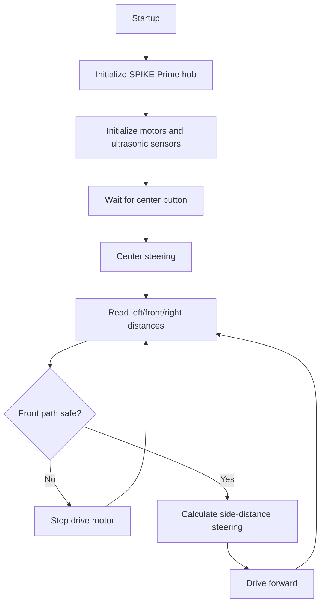

# Software Architecture

This project now uses LEGO SPIKE Prime with Pybricks MicroPython.

## Active Program

Source file:

`../src/pybricks/main.py`

Current control flow:

1. Initialize the SPIKE Prime Hub.
2. Initialize drive motor, steering motor, and three ultrasonic sensors.
3. Wait for the hub center button.
4. Center the steering motor.
5. Read left, middle/front, and right ultrasonic distances.
6. Stop if the middle/front sensor reports an unsafe or invalid distance.
7. Compare left and right distances.
8. Convert side-distance error into a steering target.
9. Drive forward while repeating the loop.

## Flowchart

## Software Modules

| Area | Current Implementation | Next Work |
| --- | --- | --- |
| Hardware setup | Port constants and Pybricks device objects in `main.py` | Confirm real ports |
| Distance reading | `read_distance()` validates ultrasonic readings | Add smoothing if needed |
| Front safety | Stop/resume thresholds with hysteresis | Tune thresholds on track |
| Wall centering | Left/right distance difference with gain | Tune gain and steering sign |
| Run control | Button start and 180-second timeout | Add official lap/end behavior |
| Obstacle challenge | Not implemented yet | Add obstacle classification and avoidance |

## State Machine Plan

| State | Purpose | Entry Condition | Exit Condition | Status |
| --- | --- | --- | --- | --- |
| Init | Configure hub, motors, sensors, constants | Program starts | Devices ready | Starter code |
| WaitForStart | Hold robot until team starts run | Init complete | Center button pressed | Starter code |
| OpenDrive | Drive using ultrasonic wall centering | Start pressed | Corner, obstacle, or timeout | Starter code |
| CornerHandling | Turn through course corners | Corner detected | Straight section found | TODO |
| ObstacleDetect | Detect red/green obstacle | Obstacle Challenge enabled | Obstacle classified | TODO |
| AvoidRed | Pass red obstacle correctly | Red obstacle detected | Safe path restored | TODO |
| AvoidGreen | Pass green obstacle correctly | Green obstacle detected | Safe path restored | TODO |
| Parking | Align and stop in parking zone if used | Final phase | Parked | TODO |
| FailSafeStop | Stop when readings are unsafe | Invalid/close front reading | Manual reset or safe reading | Starter code |

## Edge Cases To Document

- Ultrasonic reading is `None`, too close, or out of range.
- Left/right readings disagree strongly.
- Sensor sees an angled wall and reports a false long distance.
- Steering sign is reversed.
- Robot starts too close to a wall or obstacle.
- Hub battery is low and motor speed changes.

