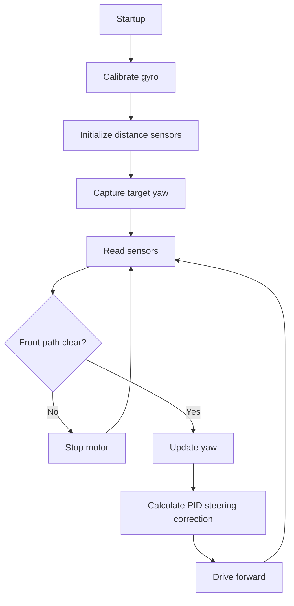

# Software Architecture

Document how the software is organized and how the robot decides what to do.

## Current Sketch

Source file:

`../src/robot_controller_improved/robot_controller_improved.ino`

Current control flow:

1. Configure motor, steering, serial, and I2C.
2. Calibrate the BMI160 gyroscope.
3. Initialize three VL53L1X distance sensors.
4. Start from the current yaw as the target heading.
5. Repeatedly update distance sensors and front safety state.
6. Integrate gyro rate into yaw.
7. Compute heading PID correction.
8. Steer to reduce heading error.
9. Drive forward unless the front safety logic blocks movement.

## Flowchart

## TODO

- Add the final state machine for Open Challenge.
- Add the final state machine for Obstacle Challenge.
- Explain obstacle color handling and passing rules.
- Explain parking behavior if implemented.
- Add edge cases, recovery behavior, and testing metrics.

